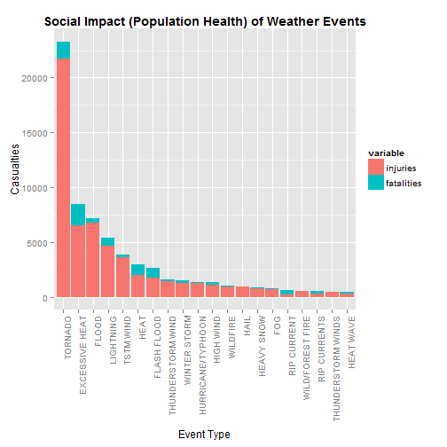

#**Social (Population Health) & Economical Impact of Weather Events**

###**1. Synopsis**
summary in at most 10 complete sentences


###**2. Data Processing**

The source of data used for this analysis is from the U.S. National Oceanic and Atmospheric Administration's (NOAA) storm data base.

The data that will be used for this report can be downloaded from :
https://d396qusza40orc.cloudfront.net/repdata%2Fdata%2FStormData.csv.bz2

Information on how the variables are constructed and defined can be found at
⋅⋅*https://d396qusza40orc.cloudfront.net/repdata%2Fpeer2_doc%2Fpd01016005curr.pdf
⋅⋅*https://d396qusza40orc.cloudfront.net/repdata%2Fpeer2_doc%2FNCDC%20Storm%20Events-FAQ%20Page.pdf

The following steps can then be taken to extract the file and prepare the source for analysis.


```r
setwd("C:\\Users\\ychen06\\Documents\\IDA MOOC\\Git\\RepData_PeerAssessment2")
data<- read.csv("repdata-data-StormData.csv.bz2")
data$year = as.numeric(format(as.Date(data$BGN_DATE, format = "%m/%d/%Y %H:%M:%S"),"%Y"))
```

Pacakges required to run analysis:


```r
library(dplyr)
library(tidyr)
library(ggplot2)
```
Columns from the data source are as follow:

```r
names(data)
```

```
##  [1] "STATE__"    "BGN_DATE"   "BGN_TIME"   "TIME_ZONE"  "COUNTY"    
##  [6] "COUNTYNAME" "STATE"      "EVTYPE"     "BGN_RANGE"  "BGN_AZI"   
## [11] "BGN_LOCATI" "END_DATE"   "END_TIME"   "COUNTY_END" "COUNTYENDN"
## [16] "END_RANGE"  "END_AZI"    "END_LOCATI" "LENGTH"     "WIDTH"     
## [21] "F"          "MAG"        "FATALITIES" "INJURIES"   "PROPDMG"   
## [26] "PROPDMGEXP" "CROPDMG"    "CROPDMGEXP" "WFO"        "STATEOFFIC"
## [31] "ZONENAMES"  "LATITUDE"   "LONGITUDE"  "LATITUDE_E" "LONGITUDE_"
## [36] "REMARKS"    "REFNUM"     "year"
```

To investigate the social (Population Health) impact of weather events, we look at the following factors.
1. INJURIES
2. FATALIEIS

To investigate the economic impact of weather events, we look at the following factors.
1. PROPDMG
2. CROPDMG

We start by removing data with zero values in all 4 of these columns, and filtering for years 1995-2011 to account for changes in readiness to response to emergencies over the years, and quality of data.


```r
data$sum <- data$FATALITIES+data$INJURIES+data$CROPDMG+data$PROPDMG
data_clean <- subset(data,data$sum>0)
data_clean_yr <- subset(data_clean, data_clean$year>1994)
```


###**3a. Steps for Analyzing Data - Population Health**

Aggregate data by Event Type for the 2 selected measurements (Injuries & Fatalities) . Store the Top 20 for each event type.

```r
fatalities <- tbl_df(aggregate(data_clean_yr$FATALITIES,by=list(data_clean_yr$EVTYPE),FUN=sum))
fatalities <-rename(fatalities,EventType=Group.1, fatalities=x)

injuries <- tbl_df(aggregate(data_clean_yr$INJURIES,by=list(data_clean_yr$EVTYPE),FUN=sum))
injuries <- rename(injuries,EventType=Group.1, injuries=x)

health <- merge(injuries,fatalities,by="EventType")
health$Total.Casualties <- health$injuries+health$fatalities
health <-arrange(health,desc(Total.Casualties))
top20_health <- health[1:20,]
library(reshape2) 
health <- melt(health[,c('EventType','injuries','fatalities')],id.vars=1)
health20 <- subset(health,health$EventType %in% top20_health$EventType)
```

###**3b. Steps for Analyzing Data - Economic Imppact**

Aggregate data by Event Type for the 2 selected measurements (Cropdmg & Propdmg) . Store the Top 20 for each event type.

```r
cropdmg <- tbl_df(aggregate(data_clean_yr$CROPDMG,by=list(data_clean_yr$EVTYPE),FUN=sum))
cropdmg <-rename(cropdmg,EventType=Group.1, cropdmg=x)

propdmg <- tbl_df(aggregate(data_clean_yr$PROPDMG,by=list(data_clean_yr$EVTYPE),FUN=sum))
propdmg <- rename(propdmg,EventType=Group.1, propdmg=x)

economic <- merge(cropdmg,propdmg,by="EventType")
economic$Total.Cost <- economic$cropdmg+economic$propdmg
economic <-arrange(economic,desc(Total.Cost))
top20_cost <- economic[1:20,]
economic_melt <- melt(economic[,c('EventType','cropdmg','propdmg')],id.vars=1)
economic20 <- subset(economic_melt,economic_melt$EventType %in% top20_cost$EventType)
economic$ProportionCrop <- economic$cropdmg/economic$Total.Cost
economic20_p <- subset(economic,economic$EventType %in% top20_cost$EventType)

mean_crop_prop <- sum(data_clean_yr$CROPDMG)/(sum(data_clean_yr$CROPDMG)+sum(data_clean_yr$PROPDMG))
```

###**4a. Results - Population Health**

Overall,injuries due to weather events has affected more people as compared to fatalities. 

The most dangerous weather event type which contributed to the most significant nnumber of casualties (Fatalities or Injuries) was Tornados. The volume of casualties far exceeds all other weather event types. Excessive Heat and Flooding are the the next most dangerous form of weather event.


```r
healthplot<-ggplot(health20,aes(x=reorder(EventType,-value),y=value))+geom_bar(stat="identity",aes(fill=variable))+ theme(axis.text.x = element_text(angle = 90, hjust = 1))+xlab("Event Type")+ylab("Casualties")+ggtitle("Social Impact (Population Health) of Weather Events")+theme(plot.title = element_text(lineheight=.8, face="bold"))

healthplot
```

 

###**4b. Results - Economic Impact**

Overall,property damange due to weather events has cost the economy more than as compared to crop damge. 

The top 3 most costly weather events are, Flash Flood, Tstm/Wind and Tornado, which proportaionally more damage being attributed to properrt.


```r
economicplot<-ggplot(economic20,aes(x=reorder(EventType,-value),y=value))+geom_bar(stat="identity",aes(fill=variable))+ theme(axis.text.x = element_text(angle = 90, hjust = 1))+xlab("Event Type")+ylab("Total Cost")+ggtitle("Economic Impact of Weather Events")+theme(plot.title = element_text(lineheight=.8, face="bold"))
```


Hail records as the 4th most costly event, but appears to follow a different trend from other weather events. Compared to the average of 13.5%, Hail results in 46% damange in crops.


```r
prop_economicplot <- ggplot(economic20_p,aes(x=reorder(EventType,-Total.Cost),y=ProportionCrop))+geom_line(aes(group=1))+ theme(axis.text.x = element_text(angle = 90, hjust = 1))+xlab("Event Type")+ylab("Proportion of Cost by Crop Damage")+ggtitle("Proportion of Damnage due to Crops")+theme(plot.title = element_text(lineheight=.8, face="bold"))
```

